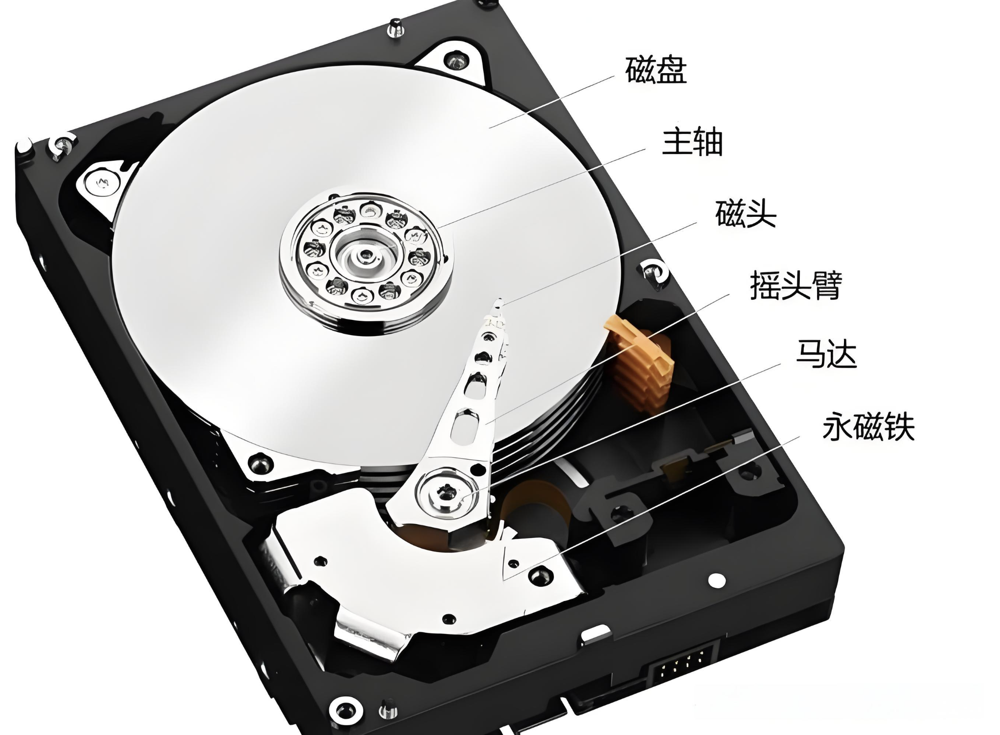
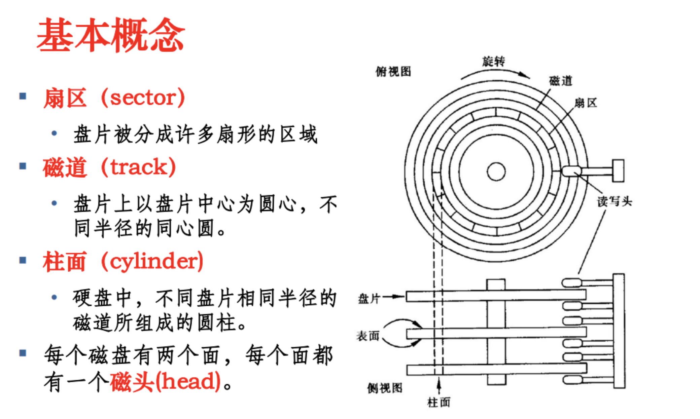

## 1、硬盘的内部结构

**硬盘的读写速度 = 磁头的寻道时间 + 等待磁盘旋转时间 + 读写速度**

## 2、硬盘的读写模式
### 2.1、CHS
基于物理结构的寻址方式，通过 ​柱面（Cylinder）​、磁头（Head）​、扇区（Sector）​​ 三个参数定位数据。

### 2.2、LBA
基于逻辑块的抽象寻址，将硬盘划分为连续的 ​逻辑块（Logical Block）​，每个块分配唯一的地址（从 0 开始递增）。LBA28/LB48/LBA64

## 3、如何读取硬盘数据
|端口  |	作用|
|-----|------|
|0x1F0|数据端口|
|0x1F1|错误信息端口|
|0x1F2|指定读取或写入的扇区数|
|0x1F3|lba地址的低8位|
|0x1F4|lba地址的中8位|
|0x1F5|lba地址的高8位|
|0x1F6|混合位，见下面详细解释|
|0x1F7|命令位和状态位|

**0x1F6:**
- 前4位是 LBA28 的最高 4 位。
- 第5位 device 是位，0 位主盘，1 为副盘
- 第6位固定值为 1
- 第7位，LBA模式为 1，CHS模式为 0
- 第8位固定值为 1

0x1F7:读取或者写入的命令,读取扇区:0x20 写入扇区:0x30; 等待返回磁盘状态, 第 4 位为 1 表示硬盘准备好数据传输，第 7 位为 1 表示硬盘忙

## 8086 内存布局图
|起始地址	|大小	|用途|
|-----|------|------|
|0x00000	|1KB	|BIOS的中断向量表|
|0x00400	|256B	|BIOS数据区|
|0x00500	|29KB+768B	|可用区域|
|0x07C00	|512B	|引导扇区数据，被BIOS加载到此处|
|0x07E00	|607KB+512B	|可用区域|
|0x9FC00	|1KB	|扩展BIOS数据区|
|0xA0000	|64KB	|彩色显示适配器缓存|
|0xB0000	|32KB	|黑白显示适配器缓存|
|0xB8000	|32KB	|文本模式显示适配器缓存|
|0xC0000	|32KB	|显示适配器BIOS|
|0xC8000	|160KB	|映射硬件适配器ROM或内存映射式的IO|
|0xF0000	|64KB	|BIOS程序，入口地址在0xFFFF0|

