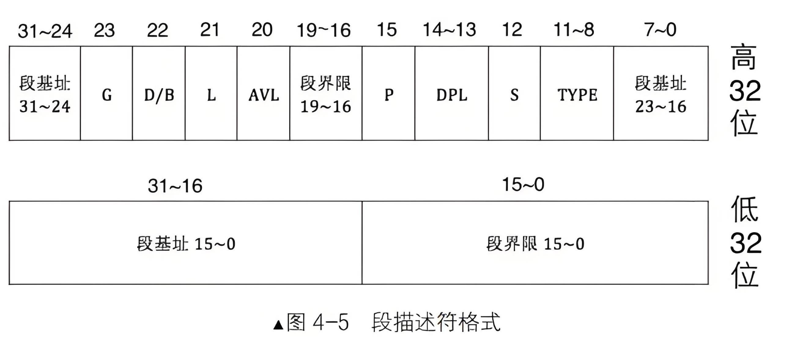

## 8086实模式与保护模式
实模式：初始模式，直接访问物理内存（仅1MB），无内存保护。  
​保护模式：通过硬件的段部件支持实现内存分段、特权级控制等，通过段部件间接访问内存，32位可访问4G内存。

## 保护模式内存访问
逻辑地址 -> 段部件（线性地址） -> 页部件（虚拟地址） -> 物理地址

## lgdt
实模式：数据地址​ = ds << 4 + 偏移量。
保护模式：数据地址 = 段选择子+偏移量  
```cpp
lgdt source  
```
source 是一个内存地址（通常是一个指向 GDT 描述符的指针），包含两个值：  
​低16位：GDT 的长度（即 GDT_end - GDT_start）。每个段描述符占 8 字节，所以最大是 8192 个描述符。  
​高32位：GDT 的基址（物理地址）。

## 段描述符


- 段基址：保护模式下地址总线宽度是32位，段基址需要用32位地址来表示  
- 段界限：20位，段界限表示段边界的扩展最值。内存访问需要用到“段基址：段内偏移地址”，段界限其实是用来限制段内偏移地址的
。实际的段界限边界值 =（描述符中段界限+1）*（段界限的颗粒大小：4KB或1）-1  


- TYEP字段：4 位，用来指定本描述符的类型。段描述符在 CPU 眼里分为两大类，要么描述的是系统段，要么描述的是数据段，这是由段描述符中 S 位决定的，用它指示是否是系统段。  
在 CPU 眼里，凡是硬件运行需要用到的东西都可以称之为系统，凡是软件（操作系统也属于软件）需要的东西都称为数据，我们主要关注非系统段  
-A 位表示 accessed 位，这是由 CPU 来设置的，每当该段被 CPU 访问后，CPU 就将此位置 1。
-C 表示一致性代码  
-R 表示可读，R 为 1 表示可读，R 为 0 表示不可读  
-X 表示该段是否可执行。X 为 1 表示可执行，0 表示不可执行  
-E 用来标识段的扩展方向，E 为 0 表示向上扩展，即地址越来越高，通常用于代码段和数据段。E 为 1 表示向下扩展，地址越来越低，通常用于栈段。  
-W 指是否可写，W 为 1 表示可写，0 表示不可写  
代码段：1010  
数据段：0010

- S 字段：S为1表示数据段，S为0表示系统段
- DPL 字段：描述符特权级，这两位能表示4种特权级，分别是0、1、2、3、4级特权。数字越小权力越大
- P 字段：段是否存在于内存中，存在 P 为 1，不存在 P 位 0。P 字段是由 CPU 来检查的。
- AVL 字段：可用的，是针对用户来说的，也就是操作系统可以随意用此位。
- L 字段：用来设置是否64位代码段。L为1表示64位代码段，L为0表示32位代码段
- D/B字段：用来指示有效地址（段内偏移地址）及操作数的大小。
对于代码段来说，此位是D位，若D为0，表示指令中的有效地址和操作数都是16位，指令有效地址用IP寄存器。若D为0，表示指令中的有效地址及操作数为32位，指令有效地址用EIP寄存器
对于栈段来说，此位是B位，用来指定操作数大小。若B为0，使用SP寄存器，也就是栈的起始地址是16位寄存器的最大寻址范围，0xFFFF。若B为1，使用的是ESP寄存器，也就是栈的起始地址是32寄存器的最大寻址范围，0xFFFFFFFF。
- G字段：粒度，它与段界限一起来决定段的大小。若G为0，表示段界限的单位是1字节，这样的段最大是2的20次方*1字节，即1MB。若G为1，表示段界限的单位是4KB，这样段最大是2的20次方*4KB，即4GB。

## 段选择子


- 第 0~1 位用来存储 RPL。
- 第 2 位是 TI 位，用来指示选择子是在 GDT 中，还是在 LDT 中索引描述符。
- 第 3~15 位是描述符的索引值，用此值在 GDT 中索引描述符，由于选择子的索引部分是 13 位，即 2 的 13 次方等于 8192，故最多可索引 8192 个段，这和 GDT 中最多定义 8192 个描述符吻合。

## DPL
描述符特权级，这两位能表示 4 种特权级，分别是 0、1、2、3 级特权。数字越小权力越大。操作系统一般默认在 0 特权级，应用程序默认在 3 特权。硬件指令和一些特殊的 cpu 指令只能在 0 特权级执行