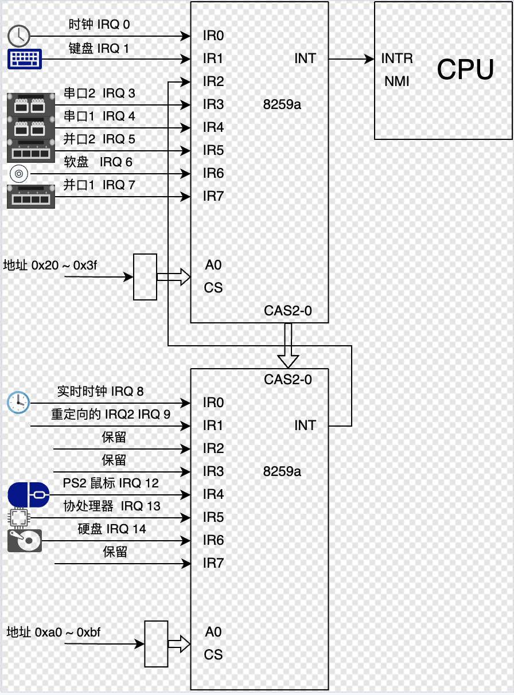
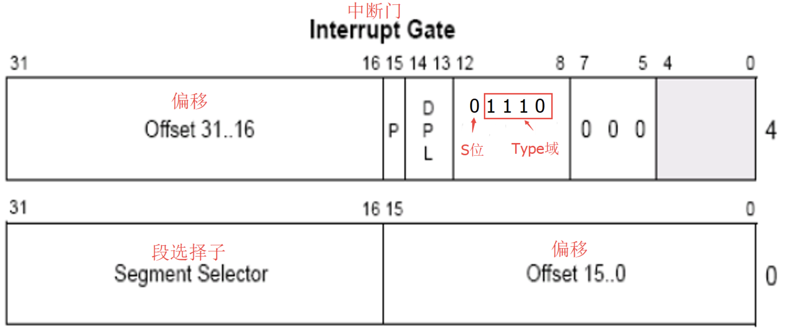

## 中断

中断是计算机系统中一种重要的机制，用于处理异步事件或紧急任务。当某个事件发生时（如硬件设备请求、程序错误等），处理器会暂停当前的任务，转而去处理该事件，处理完成后再恢复原来的任务。中断机制使得计算机能够高效地响应外部事件，同时保证系统的实时性和可靠性。

## 中断分类
### 1、硬件中断：
由硬件设备触发，例如键盘输入、鼠标点击、磁盘 I/O 完成等。硬件中断又可以分为：
- 可屏蔽中断：可以通过设置中断屏蔽位来忽略（如键盘输入）。
- 不可屏蔽中断（NMI）：必须立即处理，通常用于严重错误（如内存校验错误）。

### 2、软件中断：
由程序主动触发，通常用于系统调用或异常处理。例如，程序通过 int 指令触发中断，请求操作系统提供服务。

### 3、异常：
由 CPU 执行指令时检测到的错误或特殊情况触发，例如除零错误、页面故障、非法指令等。异常通常分为：
- 故障（Fault）：可修复的错误，修复后可以重新执行指令。
- 陷阱（Trap）：用于调试或系统调用，执行后继续下一条指令。
- 终止（Abort）：严重错误，无法修复，通常导致程序终止。

## 中断流程
中断的处理流程通常分为以下几个步骤：
### 1、中断触发：
硬件设备或软件触发中断，向 CPU 发送中断信号。

### 2、保存现场：
CPU 暂停当前任务的执行，保存当前的上下文（如程序计数器、寄存器状态等），以便中断处理完成后恢复。

### 3、识别中断源：
CPU 通过中断向量表（Interrupt Vector Table）或中断描述符表（IDT）确定中断的类型和来源。

### 4、执行中断处理程序：
CPU 跳转到对应的中断处理程序（Interrupt Service Routine, ISR）执行。
如果是硬件中断，操作系统可能会调用设备驱动程序来处理。
如果是软件中断（如系统调用），操作系统会根据中断号执行相应的服务。

### 5、恢复现场：
中断处理完成后，CPU 恢复之前保存的上下文，继续执行被中断的任务。

### 6、返回原任务：
通过特定的指令（如 iret）返回到被中断的程序，继续执行。

## 配置中断控制芯片

### 中断控制器编程
在 8259A 内部有两组寄存器：

初始化命令寄存器组，保存初始化命令字 (Initialization Command Words, ICW), ICW 共 4 个， ICW1 ~ ICW4；
操作命令寄存器组，保存操作命令字 (Operation Command Word, OCW), OCW 共 3 个， OCW1 ~ OCW3；
ICW 做初始化，用来确定是否需要级联，设置起始中断向量号，设置中断结束模式。其编程就是往 8259A 的端口发送一系列 ICW。由于从一开始就要决定 8259A 的工作状态，所以要一次性写入很多设置，某些设置之间是具有关联、依赖性的，也许后面的某个设置会依赖前面某个 ICW 写入的设置，所以这部分要求严格的顺序，必须依次写入 ICW1、ICW2、ICW3、ICW4；

OCW 来操作控制 8259A，前面所说的中断屏蔽和中断结束，就是通过往 8259A 端口发送 OCW 实现的。OCW 的发送顺序不固定，3 个之中先发送哪个都可以。

------------------------------------------------
### ICW1 连接 / 触发方式
ICW1 用来初始化 8259A 的连接方式和中断信号的触发方式，共一个字节: 

- 连接方式: 是指用单片工作，还是用多片级联工作；
- 触发方式: 是指中断请求信号是电平触发，还是边沿触发；

| 7	| 6	| 5 | 4 | 3 | 2 | 1 | 0 |
|---|---|---|---|---|---|---|---|
| 0 | 0 | 0 | 1 | LTIM | ADI | SINGL | IC4 |

ICW1 需要写入到主片的 0x20 端口和从片的 0xA0 端口；

IC4 表示是否要写入 ICW4，这表示，并不是所有的 ICW 初始化控制字都需要用到；IC4 为 1 时表示需要在后面写入 ICW4 ，为 0 则不需要。注意，x86 系统 IC4 必须为1

SNGL 表示 single，若 SNGL 为 1 ，表示单片，若 SNGL 为 0，表示级联(Cascade)。若在级联模式下，这要涉及到主片和从片用哪个 sIRQ 接口互相连接的问题，所以当 SNGL 为 0 时，主片和从片也是需要设置 ICW3 的。

ADI 表示 Call Address Interval，用来设置 8085 的调用时间间隔， x86 不需要设置。

LTIM 表示 Level/Edge Triggered Mode，用来设置中断检测方式，LTIM 为 0 表示边沿触发，LTIM 为 1 表示电平触发；

第 4 位的 1 是固定的，这是 ICW1 的标记；

第 5 ~ 7 位专用于 8085 处理器，x86 不需要，直接置为 0 即可；

### ICW2 向量号
ICW2 用来设置起始中断向量号，一般为 0x20，如下表所示，共一个字节；

| 7	| 6	| 5 | 4 | 3 | 2 | 1 | 0 |
|---|---|---|---|---|---|---|---|
| T7 | T6 | T5 | T4 | T3 | ID2 | ID1 | ID0 |

由于每个 8259A 芯片上的 IRQ 接口是顺序排列的，所以咱们这里的设置就是指定 IRQ0 映射到的中断向量号，其他 IRQ 接口对应的中断向量号会顺着自动排列下去。

ICW2 需要写入到主片的 0x21 端口和从片的 0xA1；

由于咱们只需要设置 IRQ0 的中断向量号， IRQ1IRQ7 的中断向量号是 IRQ0 的顺延，所以，只需填写高 5 位 T3T7，ID0~ID2 这低 3 位不用填。

由于只填写高 5 位，所以任意数字都是 8 的倍数，这个数字表示的便是设定的起始中断向量号。

这是有意设计的，低 3 位能表示 8 个中断向量号，这由 8259A 根据 8 个 IRQ 接口的排列位次自行导入，IRQ0 的值是 000, IRQ1 的值是001, IRQ2 的值便是 010 ... 以此类推，这样高 5 位加低 3 位，便表示了任意一个 IRQ 接口实际分配的中断向量号。

### ICW3 级联方式
ICW3 仅在级联的方式下才需要 (如果 ICW1 中的 SNGL 为 0)，用来设置主片和从片用哪个 IRQ 接口互连。

由于主片和从片的级联方式不一样，对于这个 ICW3，主片和从片都有自己不同的结构。

对于主片，ICW3 中置 1 的那一位对应的 IRQ 接口用于连接从片，若为 0 则表示接外部设备。比如，若主片 IRQ2 和 IRQ5 接有从片，则主片的 ICW3 为 00100100。

主片如下表所示，共一个字节；

| 7	| 6	| 5 | 4 | 3 | 2 | 1 | 0 |
|---|---|---|---|---|---|---|---|
|S7	|S6	|S5	|S4	|S3	|S2	|S1| S0|

对于从片，要设置与主片 8259A 的连接方式，不需要指定用自己的哪个 IRQ 接口与主片连接，从片上专门用于级联主片的接口并不是 IRQ。

从片如下表所示，共一个字节；

| 7	| 6	| 5 | 4 | 3 | 2 | 1 | 0 |
|---|---|---|---|---|---|---|---|
|0	|0	|0	|0	|0	|ID2| ID1 |ID0|

如果从片用 IRQ 接口连接主片，若主片只级联一个从片，在从片上指定的 IRQ 接口便默认与主片上做级联的那个 IRQ 接口匹配了。但如果主片级联多个从片时，在从片上还要设置自己用于连接主片的 IRQ 接口与主片上连接从片的哪个 IRQ 接口（有多个）对接，这反而更麻烦。所以，设置从片连接主片的方法是只需要在从片上指定主片用于连接自己的那个 IRQ 接口就行了。

在中断响应时，主片会发送与从片做级联的 IRQ 接口号，所有从片用自己的 ICW3 的低 3 位和它对比，若一致则认为是发给自己的。

比如主片用 IRQ2 接口连接从片 A，用 IRQ5 接口连接从片 B；从片 A 的 ICW3 的值应该设为 0b00000010，就是十进制数 2，从片 B 的 ICW3 的值应该设为 0b00000101，就是十进制数 5；所以，从片 ICW3 中的低 3 位 ID0 ~ ID2 就够了，高 5 位不需要，为 0 即可。

### ICW4 工作模式
ICW4 用于设置 8259A 的工作模式，当 ICW1 中的 IC4 为 1 时才需要 ICW4；

如下表所示，共一个字节；

| 7	| 6	| 5 | 4 | 3 | 2 | 1 | 0 |
|---|---|---|---|---|---|---|---|
|0	|0	|0	|SFNM| BUF| M/S |AEOI|	μPM|

ICW4 需要写入主片的 0x21 及从片的 0xA1 端口；

第 7~5 位未定义，直接置为 0 即可；

SFNM 表示特殊全嵌套模式(Special Fully Nested Mode)，若 SFNM 为 0，则表示全嵌套模式，若 SFNM 为 1，则表示特殊全嵌套模式。

BUF 表示本 8259A 芯片是否工作在缓冲模式。BUF 为 0 ，则工作非缓冲模式，BUF 为 1 ，则工作在缓冲模式。

M/S 用于指定主片和从片；当多个 8259A 级联时，如果工作在缓冲模式下(BUF = 1)，若 M/S 为 1 ，则表示则表示是主片，若 M/S 为0，则表示是从片。若工作在非缓冲模式下(BUF = 0)， M/S 无效。

AEOI 表示自动结束中断 (Auto End Of Interrupt)，8259A 在收到中断结束信号时才能继续处理下一个中断，此项用来设置是否要让 8259A 自动把中断结束。

若 AEOI 为 0 ，则表示非自动，即手动结束中断，可以在中断处理程序中手动向 8259A 的主、从片发送 EOI 信号。这种 操作 类命令，通过下面要介绍的 OCW 进行；
若 AEOI 为 1 ，则表示自动结束中断；
μPM 表示微处理器类型 (microprocessor)，此项是为了兼容老处理器。若 μPM 为 0，则表示 8080 或 8085 处理器，若 μPM 为1 ，则表示 x86 处理器。

### OCW1 屏蔽字
OCW1 用来屏蔽连接在 8259A 上的外部设备的中断信号，如下表所示，共一个字节；

| 7	| 6	| 5 | 4 | 3 | 2 | 1 | 0 |
|---|---|---|---|---|---|---|---|
|M7	|M6	|M5	|M4	|M3	|M2	|M1| M0|

实际上就是把 OCW1 写入了即 IMR 寄存器。这里的屏蔽是说是否把来自外部设备的中断信号转发给 CPU。由于外部设备的中断都是可屏蔽中断，所以最终还是要受标志寄存器 eflags 中的 IF 位的管束，若 IF 为 0，可屏蔽中断全部被屏蔽，也就是说，在 IF 为 0 的情况下，即使 8259A 把外部设备的中断向量号发过来，CPU 也置之不理。

OCW1 要写入主片的 0x21 或从片的 0xA1 端口；

### 其他的问题

8259A 就 2 个端口地址，它是如何识别 4 个 ICW 和 3 个 OCW 的？

ICW1，OCW2，OCW3 是用偶地址端口主片的 0x20 或从片的 0xA0 写入。

ICW2~ICW4 和 OCW1 是用奇地址端口主片的 0x21 或从片的 0xA1 写入。

以上 4 个 ICW 要保证一定的次序写入，8259A 就知道写入端口的数据是什么了。

## 设置中断向量表
### IDT 描述符结构
idt_ptr 指向的内存区域包含以下信息：  
限制（Limit）：2 字节，表示 IDT 的大小（字节数减一）。  
基地址（Base）：4 字节（32 位模式下）或 8 字节（64 位模式下），表示 IDT 的起始地址。  

### 中断描述符

- S位为0，表示该段描述符为系统段描述符（中断门描述符属于系统段描述符）
- Type域为1110，表示该段描述符为32位中断门
- 低16位到31位存储一个段选择子，该段选择子才和代码真正要调用的地址相关
- 真正要调用的地址 = 段选择子所指向的段.Base + 32位的段中偏移 （段中偏移分为两部分：高位31-16位和低位15-0位）
- P 位为有效位
- DPL 是特权级别

### 中断列表

|编号	|名称|	类型|	助记符|	错误码|
|---|---|---|---|---|
|0 (0x0)|	除零错误|	故障|	#DE	|无|
|1 (0x1)|	调试|	故障/陷阱|	#DB	|无|
|2 (0x2)|	不可屏蔽中断|	中断|	-	|无|
|3 (0x3)|	断点|	陷阱|	#BP	|无|
|4 (0x4)|	溢出|	陷阱|	#OF	|无|
|5 (0x5)|	越界|	故障|	#BR	|无|
|6 (0x6)|	指令无效|	故障|	#UD	|无|
|7 (0x7)|	设备不可用|	故障|	#NM	|无|
|8 (0x8)|	双重错误|	终止|	#DF	|有 (Zero)|
|9 (0x9)|	协处理器段超限|	故障|	-	|无|
|10 (0xA)|	无效任务状态段|	故障|	#TS	|有|
|11 (0xB)|	段无效	|故障|	#NP	|有|
|12 (0xC)|	栈段错误|	故障|	#SS	|有|
|13 (0xD)|	一般性保护异常|	故障|	#GP	|有|
|14 (0xE)|	缺页错误|	故障|	#PF	|有|
|15 (0xF)	|保留|	|-	|-	|无|
|16 (0x10)	|浮点异常|	故障|	#MF|	无|
|17 (0x11)	|对齐检测|	故障|	#AC	|有|
|18 (0x12)	|机器检测|	终止|	#MC|	无|
|19 (0x13)	|SIMD 浮点异常|	故障|	#XM/#XF|	无|
|20 (0x14)	|虚拟化异常|	故障|	#VE|	无|
|21 (0x15)	|控制保护异常|	故障|	#CP|	有|
|22-31 (0x16-0x1f)|	保留|	-	|-	|无|

32 - 48 是我们配置的控制芯片的中断
48 - 256 我们操作系统可以自己使用，linux 的系统调用一般是 int 0x80 号

### ret 与 iret

#### 1. ret 指令

ret（Return）用于从普通的函数调用中返回。它的作用是从栈中弹出返回地址，并将程序控制流跳转到该地址。

工作原理：
ret 从栈顶弹出返回地址（EIP 或 RIP），并将程序计数器（PC）设置为该地址。如果使用 ret n（带操作数的 ret），则在弹出返回地址后，还会将栈指针（ESP 或 RSP）增加 n 字节，以清理栈上的参数。

使用场景：用于从普通的函数调用中返回。不涉及特权级切换或上下文恢复。

### 2. iret 指令
iret（Interrupt Return）用于从中断处理程序或异常处理程序中返回。它的作用是从栈中弹出返回地址、标志寄存器（EFLAGS 或 RFLAGS）以及代码段寄存器（CS），并将程序控制流跳转到返回地址。

iret 从栈中依次弹出以下内容：
- 返回地址（EIP 或 RIP）
- 代码段寄存器（CS）
- 标志寄存器（EFLAGS 或 RFLAGS）

如果涉及特权级切换（例如从内核态返回到用户态），iret 还会弹出栈指针（ESP 或 RSP）和栈段寄存器（SS）。

使用场景：用于从中断处理程序或异常处理程序中返回。涉及特权级切换或上下文恢复。

## 时钟中断
时钟芯片 8253 内部有 3 个独立的计数器，分别是计数器 0 ~ 2，端口号分别为 0x40 ~ 0x42；每个计数器完全相同，都是 16 位大小，相互独立，互不干涉。

8253 计数器是个减法计数器，从初值寄存器中得到初值，然后载入计数器中，然后随着时钟变化递减。计数器初值寄存器，计数器执行寄存器，和输出锁存器都是 16 位的寄存器，高八位和低八位可以单独访问。

计数器 0，端口号 0x40，用于产生时钟信号，它采用工作方式 3；

端口号 0x43，控制字寄存器，是 8 位寄存器，控制字寄存器也成为模式控制寄存器，用于指定计数器的工作方式、读写格式及数制。

|7	|6	|5	|4	|3	|2	|1	|0  |
|---|---|---|---|---|---|---|---|
|SC1|SC0|RL1|RL0|M2	|M1	|M0	|BCD|

- SC(Select Counter) 0 ~ 1：计数器选择位  
00 计数器 0  
01 计数器 1  
10 计数器 2  
11 无效  

- RL(Read Load) 0 ~ 1：读写操作位  
00 锁存数据，供 CPU 读  
01 只读写低字节  
10 只读写高字节  
11 先读写低字节，后读写高字节  

- M (Mode) 0 ~ 2：模式选择  
000：模式 0 ，计数结束时中断  
001：模式 1 ，硬件可重触发单稳方式  
x10：模式 2 ，比率发生器，用于分频  
x11：模式 3 ，方波发生器  
100：模式 4 ，软件触发选通  
101：模式 5 ，硬件触发选通  

- BCD：(Binary Coded Decimal) 码  
0 表示二进制计数器  
1 二进制编码的十进制计数器  

0b00110100