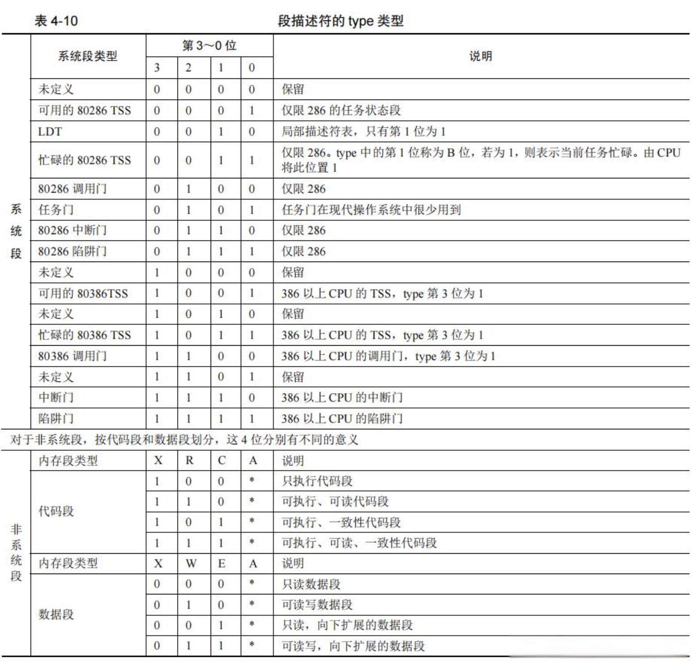

## tss（任务状态段）

```cpp
typedef struct task_state_segment {
    // 上一个任务的指针
    u32_t previous_task_link;
    // 三个不同优先级的栈
    u32_t* esp0;
    u32_t ss0;
    u32_t* esp1;
    u32_t ss1;
    u32_t* esp2;
    u32_t ss2;
    // 跟虚拟内存有关，指向页表
    u32_t cr3;
    // 当前任务运行的代码位置
    u32_t(*eip) (void);
    // 标识位寄存器
    u32_t eflags;
    // 通用寄存器
    u32_t eax, ecx, edx, ebx, esp, ebp, esi, edi;
    // 段寄存器
    u32_t es, cs, ss ,ds, fs, gs;
    // ldt 表
    u32_t ldt;
    // io 位图
    u32_t io_base;
    // 任务影子栈指针，用不上
    u32_t ssp;

} __packed tss_t;
```
## tss 描述符




## 实现软件调度
```cpp
void main_process(){
    int count = 0;
    for (;;)
    {
       printk("main process: %d\r\n",++count);
       task_switch(other_process);
    }
}

void other_process(){
    int count = 0;
    for (;;)
    {
       printk("other process: %d\r\n",++count);
       task_switch(main_process);
    }
}

global task_switch
task_switch:
    ; 保存栈帧
    push ebp
    mov ebp, esp
    mov edx, [ebp + 8]
    push edx
    ret
```
以上代码实现了两个函数交替执行打印，其实就是利用了 ret 这个指令的漏洞。单核 cpu 的软件调度实现原理就是这样。